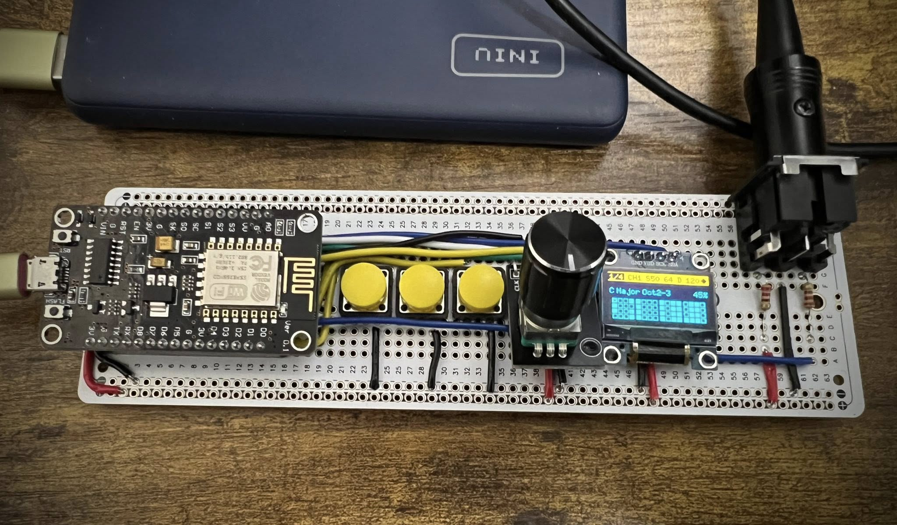
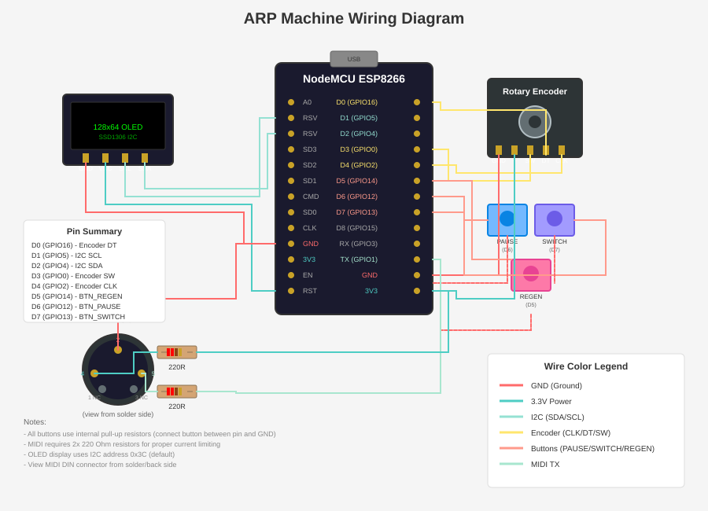

# ARP Machine

A hardware MIDI arpeggiator built on the ESP8266 microcontroller. Generates rhythmic note patterns and outputs standard MIDI messages over serial at 31250 baud.



## Features

- **4 simultaneous sequencers** on independent MIDI channels (1-16)
- **64-step sequences** with 4 rows of 16 steps, adjustable length (1-64)
- **5 musical scales**: Major, Minor, Dorian, Pentatonic, Harmonic Minor
- **Adjustable parameters**: BPM (40-240), root note, scale, octave range, note density, swing
- **Per-step effects (Fx)**: x1 (normal), x2/x3 (ratchet), R1/R2 (random notes) for rhythmic and melodic variation
- **Per-step trigger conditions**: Always, 1:2, 1:3, 1:4, or probability-based (10%, 25%, 50%, 75%)
- **Sequence editing**: Full control over step notes, division, and trigger conditions
- **Multiple generators**: Default rhythmic patterns, Chord arpeggios
- **Real-time display**: 128x64 OLED shows all parameters and step grid
- **Microsecond-precision timing** for accurate tempo at high speeds
- **Global pause/resume** controls all 4 sequencers simultaneously

## Hardware Requirements

| Component | Description |
|-----------|-------------|
| ESP8266 | NodeMCU, D1 Mini, or similar |
| OLED Display | 128x64 SSD1306 I2C (0.96") |
| Rotary Encoder | With push button (e.g., KY-040) |
| 3x Buttons | Momentary push buttons |
| MIDI Output | Serial TX to MIDI DIN circuit |
| 2x Resistors | 220 Ohm (for MIDI circuit) |

### Wiring Diagram



### Pin Configuration

```
Rotary Encoder:
  ENC_CLK   → GPIO2  (D4)
  ENC_DT    → GPIO16 (D0)
  ENC_BTN   → GPIO0  (D3)

Buttons:
  BTN_PAUSE  → GPIO12 (D6)  - Pause/Resume
  BTN_SWITCH → GPIO13 (D7)  - Cycle menu selection
  BTN_REGEN  → GPIO14 (D5)  - Regenerate sequence

I2C (OLED):
  SDA → GPIO4 (D2)
  SCL → GPIO5 (D1)

MIDI:
  TX → GPIO1 (TX) → MIDI OUT circuit
```

## Controls

### Menu Navigation

Press **BTN_SWITCH** to cycle through parameters:

| Selection | Encoder Action |
|-----------|----------------|
| Page | Switch between sequencers 1-4 |
| Channel | Set MIDI channel (1-16) for current sequencer |
| Swing | Adjust swing amount (50-75%, 50=straight) |
| Length | Adjust sequence length (1-64 steps) |
| Generator | Switch pattern generator (D=Default, C=Chord) |
| BPM | Adjust tempo (40-240 BPM) |
| Root | Change root note (C through B) |
| Scale | Cycle through 5 scales |
| Octave | Change octave range (3, 2-3, 3-4, 2-4) |
| Density | Adjust note density (10-90%) |
| Edit | Enter sequence edit mode |

### Sequence Editing

When in **Edit** mode, press **BTN_REGEN** to cycle through sub-modes:

| Sub-mode | Display | Encoder Action |
|----------|---------|----------------|
| Sequence | Neither highlighted | Move cursor through steps |
| Note | "N:" highlighted | Change note pitch (octave 2-4, follows scale) |
| Fx | "F:" highlighted | Change step effect (x1, x2, x3, R1, R2) |
| Cond | "C:" highlighted | Change trigger condition |

- **Press encoder**: Toggle step on/off (in Sequence sub-mode)
- **Long-press BTN_REGEN** (3 seconds): Clear entire sequence
- Enabling a step generates a random note following current root, scale, and octave settings
- Edit cursor always starts at step 0

### Step Effects (Fx)

| Effect | Name | Description |
|--------|------|-------------|
| x1 | Normal | Single note trigger per step |
| x2 | Ratchet x2 | Two 1/32 notes within the 1/16 step |
| x3 | Ratchet x3 | Three notes within the 1/16 step |
| R1 | Random 1 | Random note within scale, octave 3 only |
| R2 | Random 2 | Random note within scale, random octave 2-4 |

### Step Trigger Conditions

| Condition | Name | Effect |
|-----------|------|--------|
| Always | - | Note always triggers |
| 1:2 | Half-time | Triggers every 2nd time |
| 1:3 | Third-time | Triggers every 3rd time |
| 1:4 | Quarter-time | Triggers every 4th time |
| 10% | Probability | 10% chance to trigger |
| 25% | Probability | 25% chance to trigger |
| 50% | Probability | 50% chance to trigger |
| 75% | Probability | 75% chance to trigger |

### Other Controls

| Button | Action |
|--------|--------|
| BTN_PAUSE | Pause/resume playback (all 4 sequencers) |
| BTN_REGEN | Generate new sequence (or cycle edit sub-mode when editing) |
| BTN_REGEN (long) | Clear current sequence (hold 3 seconds) |

## Building & Uploading

Requires Arduino IDE or arduino-cli with ESP8266 board support.

```bash
# Install ESP8266 board support
arduino-cli core install esp8266:esp8266

# Compile
arduino-cli compile --fqbn esp8266:esp8266:nodemcuv2 arp-machine

# Upload (adjust port as needed)
arduino-cli upload --fqbn esp8266:esp8266:nodemcuv2 -p /dev/ttyUSB0 arp-machine
```

### Dependencies

- [U8g2](https://github.com/olikraus/u8g2) - Graphics library for OLED display

## Architecture

```
arp-machine/
├── arp-machine.ino        # Main entry point, input handling, event loop
├── arp.h / arp.cpp        # Arpeggiator engine (timing, patterns, playback)
├── midi.h / midi.cpp      # MIDI serial communication
├── lcd.h / lcd.cpp        # Display rendering
├── step_generator.h       # Generator interface and registry
├── default_generator.h/cpp # Default rhythmic pattern generator
├── chord_generator.h/cpp  # Chord arpeggio pattern generator
└── CLAUDE.md              # AI assistant context
```

### Component Overview

#### `arp-machine.ino` - Main Controller
- Initializes all components including 4 independent sequencer instances
- Handles rotary encoder with quadrature decoding and acceleration
- Manages button interrupts (ISR) for responsive input
- Runs main loop: input → tick all sequencers → display

**Key functions:**
- `handleEncoder()` - Rotary encoder with quadrature lookup table and acceleration
- `handleEncButton()` - Encoder button (polling with debounce)
- `handleRegenButton()` - Regen button with long-press detection for sequence clear
- `handleButtons()` - Process interrupt flags from ISRs
- `loop()` - Main event loop at ~µs resolution, ticks all 4 sequencers

#### `arp.h / arp.cpp` - Arpeggiator Engine
- 64-step pattern buffer with note values, effects, and trigger conditions
- Microsecond timing using `micros()` for note on/off scheduling
- Scale-aware note generation with configurable density
- Per-step effects (x1/x2/x3 ratchets, R1/R2 random notes) and trigger conditions (always, divisor, probability)
- Edit mode with sub-modes for sequence, note, effect, and condition editing
- Per-sequencer MIDI channel and swing settings

**Key members:**
- `steps[64]` - Note values (0 = rest, >0 = MIDI note number)
- `steps_fx[64]` - Step effect (x1, x2, x3, R1, R2)
- `steps_cond[64]` - Step trigger condition (always, 1:2, 1:3, 1:4, probability)
- `channel` - MIDI channel (0-15, displayed as 1-16)
- `swing` - Swing amount (50-75%)
- `x` - Current playhead position
- `editMode`, `editStep`, `editSubMode` - Edit state
- `_next_note_on` / `_next_note_off` - Scheduled timing thresholds
- `_ratchet_count`, `_ratchet_interval` - Ratchet playback state
- `_step_trigger_counter[64]` - Counter per step for divisor-based conditions

**Timing system:**
```cpp
_note_delays_ms = 60000000UL / bpm / 4;  // 16th note interval in µs
_note_gate_ms = _note_delays_ms / 2;      // 50% gate time

// Ratchet timing (R2 example):
_ratchet_interval = _note_delays_ms / 2;  // 1/32 note
_ratchet_gate = _ratchet_interval / 2;    // 1/64 note (50% gate)
```

#### `midi.h / midi.cpp` - MIDI Output
- Serial communication at 31250 baud (MIDI standard)
- Configurable MIDI channel (1-16) per sequencer
- Note On/Off with velocity support

**API:**
```cpp
void noteOn(uint8_t note, uint8_t velocity);
void noteOff(uint8_t note);
void allNotesOff();
```

#### `lcd.h / lcd.cpp` - Display
- U8g2 library for SSD1306 OLED
- 400kHz I2C fast mode
- Efficient redraw (only on state change)

**Display layout (normal mode):**
```
┌────────────────────────────┐
│ 1 CH1 Sw50 64 D      ● 120 │  ← Header (page, channel, swing, length, generator, beat, BPM)
│ C  Major  Oct2-3      45%  │  ← Settings row (root, scale, octave, density)
│ ■■□■ ■□■□ ■■□■ □■□■       │  ← Step grid (4 rows × 16 cols)
│ ■■□■ ■□■□ ■■□■ □■□■       │
│ ■■□■ ■□■□ ■■□■ □■□■       │
│ ■■□■ ■□■□ ■■□■ □■□■       │
└────────────────────────────┘
```

**Display layout (edit mode):**
```
┌────────────────────────────┐
│ 1 CH1 Sw50 64 D      ● 120 │  ← Header
│ N:C3    F:x1    C:1:2      │  ← Edit info (note, effect, condition)
│ ■■□■ ■□■□ ■■□■ □■□■       │  ← Step grid with edit cursor
│ ■■□■ ■□■□ ■■□■ □■□■       │
│ ■■□■ ■□■□ ■■□■ □■□■       │
│ ■■□■ ■□■□ ■■□■ □■□■       │
└────────────────────────────┘
```

### Data Flow

```
┌─────────────┐     ┌─────────────┐     ┌─────────────┐
│   Buttons   │────▶│  Main Loop  │────▶│  Arp 1-4    │
│   Encoder   │     │ (ino file)  │     │  Engines    │
└─────────────┘     └──────┬──────┘     └──────┬──────┘
                           │                   │
                           ▼                   ▼
                    ┌─────────────┐     ┌─────────────┐
                    │     LCD     │     │    MIDI     │
                    │   Display   │     │  CH 1-16    │
                    └─────────────┘     └─────────────┘
```

All 4 sequencer engines run simultaneously, each sending to its configured MIDI channel.

### Timing Architecture

The arpeggiator uses **microsecond-precision scheduling** to maintain accurate tempo:

1. `tick()` is called every loop iteration with current `micros()` value
2. Compares against `_next_note_on` and `_next_note_off` thresholds
3. Uses signed comparison `(long)(now - threshold) >= 0` to handle 32-bit wraparound
4. Schedules next events relative to current time

This approach ensures timing accuracy even at high BPM values where millisecond resolution would introduce noticeable jitter.

## Contributing

Feel free to submit issues and pull requests. Key areas for contribution:

- Additional scales and modes
- MIDI input for external sync
- Save/load patterns to EEPROM
- Additional arpeggio patterns (up, down, random, etc.)

## License

MIT License - See LICENSE file for details.

